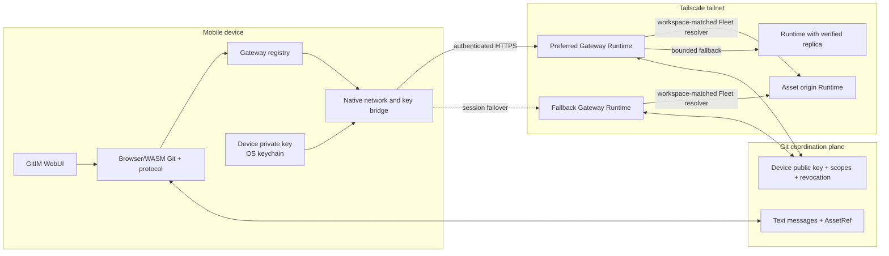
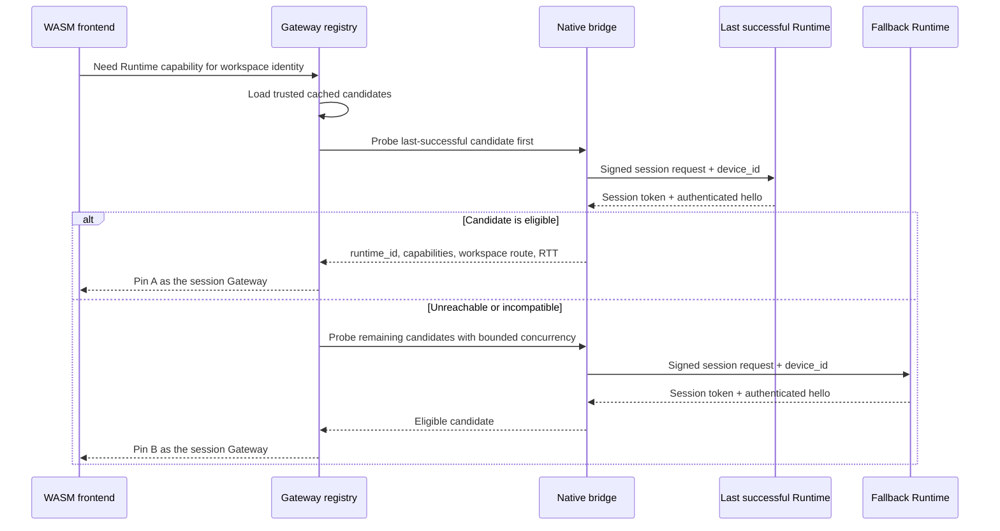
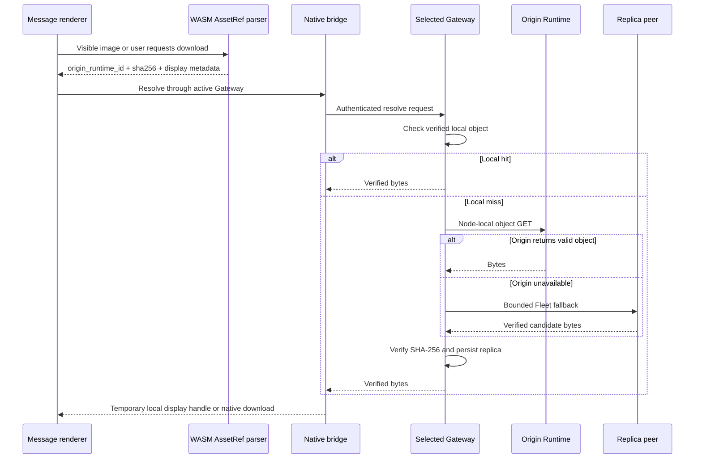
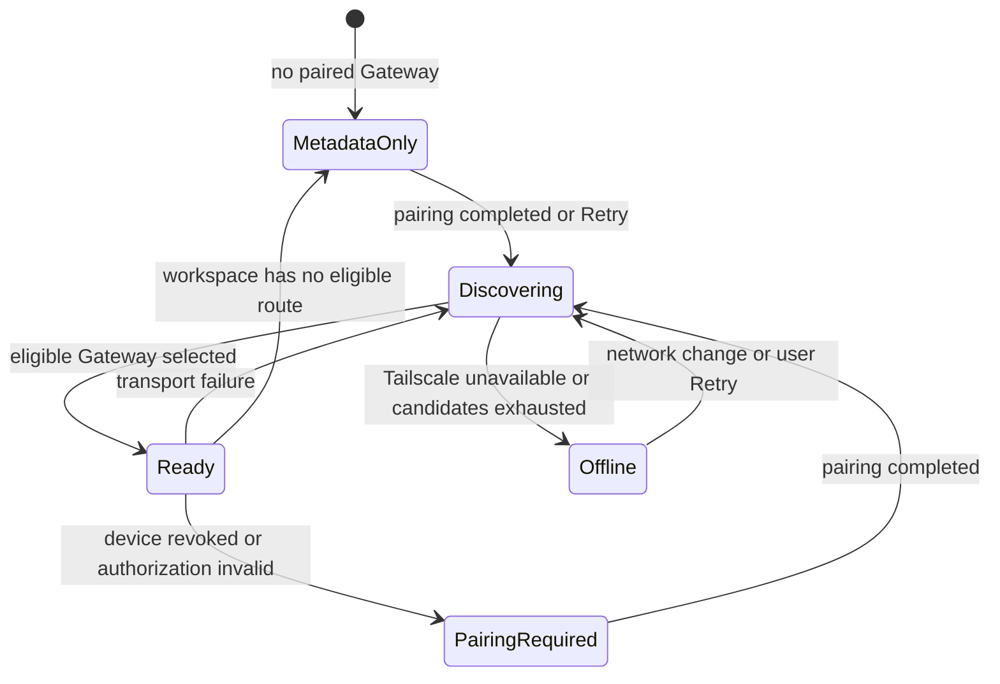

# Mobile Gateway Discovery — Architecture Direction

Status: FUTURE DESIGN NOTE

This note preserves the mobile access direction discovered during File
Attachments v1. It defines how a native mobile shell running the Browser/WASM
frontend can use Tailscale to reach Runtime-owned assets. It is outside the v1
implementation scope.

## Outcome

After one explicit pairing, a mobile device automatically selects a compatible
GitIM Runtime on the user's tailnet and uses it as a session Gateway. The WASM
frontend continues to own Git-backed message state and protocol parsing. The
Gateway owns Runtime APIs, Fleet routing, attachment integrity verification, and
persistent replicas.

Automatic discovery means automatic reconnection and failover among previously
trusted Gateway candidates. Initial trust establishment remains an explicit
pairing action because tailnet connectivity does not provide application service
enumeration or GitIM authorization.

## Topology



The phone never receives peer object URLs. It talks to one selected Gateway;
that Runtime reuses the existing local-store-first, Fleet pull-through resolver.

## Existing foundation and new boundary

File Attachments v1 already supplies the stable `runtime_id`, canonical
`workspace_identity`, Fleet workspace mappings, node-local object route,
integrity-checked pull-through resolver, and metadata-only WASM fallback. The
mobile path reuses that complete data plane after Gateway selection.

The current Runtime HTTP server is loopback-only, and Fleet `base_url` values may
point at local SSH tunnel ports. Mobile discovery therefore introduces a
distinct `mobile_endpoint` using a stable tailnet HTTPS name. The authenticated
`mobile/v1` surface is narrower than the Runtime administration API and is the
only surface exposed to the phone.

## Responsibilities

| Component | Responsibility |
|---|---|
| Browser/WASM frontend | Sync text history, parse `AssetRef`, decide when an asset is visible or requested, and render ready/unavailable states. |
| Gateway registry | Cache trusted candidates, select one Gateway per session, apply hysteresis, and coordinate failover. |
| Native mobile bridge | Hold the device key, sign session establishment, perform tailnet HTTP, stream bytes, and expose temporary display/download handles to the WebView. |
| Gateway Runtime | Authenticate the device, map workspace identity to its local slug, resolve assets locally or through Fleet, verify bytes, and persist replicas. |
| Git coordination plane | Carry durable public device authorization and revocation records. It carries no attachment bytes or device secrets. |
| Tailscale | Provide private reachability, stable DNS names, and network policy. GitIM remains responsible for application authorization. |

## Stable identities

Four identifiers have different jobs and must not be collapsed:

| Identifier | Purpose |
|---|---|
| `device_id` | Stable identity of one mobile installation. |
| `runtime_id` | Stable UUID of one GitIM Runtime installation; already present today. |
| `workspace_identity` | Canonical repository identity used to prevent cross-workspace routing. |
| local workspace slug | Gateway-local route segment returned only after the Gateway proves the matching workspace identity. |

The phone selects by `workspace_identity`, never by slug. Local and remote slugs
may differ. Candidate descriptors therefore carry an identity-to-local-slug
route supplied by the authenticated Gateway.

## Gateway surface

The mobile surface is a dedicated, authenticated API exposed through a stable
Tailscale HTTPS name. The existing loopback administration API remains local.
Only mobile-safe routes are reachable through the tailnet-facing listener or
proxy:

```text
POST /mobile/v1/session
GET  /mobile/v1/hello
GET  /mobile/v1/gateways
GET  /mobile/v1/workspaces/{gateway_slug}/assets/resolve/{origin_runtime_id}/{sha256}
POST /mobile/v1/workspaces/{gateway_slug}/assets
```

`hello` returns the authenticated Runtime identity and capability manifest:

```json
{
  "runtime_id": "3c6a295e-744a-41dc-ba60-5c21bb94e5a2",
  "protocol_version": 1,
  "capabilities": ["asset.resolve.v1", "asset.upload.v1"],
  "workspace_routes": [
    {
      "workspace_identity_hash": "sha256:...",
      "gateway_slug": "room",
      "role": "preferred"
    }
  ],
  "fleet_generation": 42
}
```

The identity hash lets the phone match a local WASM workspace without exposing
the repository URL in discovery logs. The full identity remains available to
the Gateway internally for the existing Fleet matching invariant.

## Pairing and fleet-wide authorization

The mobile shell generates an Ed25519 key pair. The private key stays in the OS
keychain and is only used by the native bridge. Pairing authorizes the public
key for selected workspace identities and scopes.

A durable authorization record is text metadata synchronized by Git:

```yaml
version: 1
device_id: 63ee09bd-26b7-4be3-8127-8e48cb21da73
owner: lewisliu
public_key: ed25519:BASE64_PUBLIC_KEY
scopes:
  - assets.read
  - assets.write
workspace_identities:
  - sha256:WORKSPACE_IDENTITY_HASH
created_at: 2026-07-13T12:00:00Z
revoked_at: null
```

The Runtime daemon remains the writer and validates owner authority, scope, and
schema before committing the record. Revocation updates the same record. Fleet
nodes recognize the device after normal Git synchronization, so the same device
identity can establish a short-lived session with any eligible Gateway without
sharing a bearer secret across nodes.

The initial QR/deep link contains only bootstrap material:

```text
gitim://pair?v=1
  &endpoint=https%3A%2F%2Fmacbook.tailnet-name.ts.net
  &runtime_id=3c6a295e-744a-41dc-ba60-5c21bb94e5a2
  &workspace=sha256%3A...
  &nonce=ONE_TIME_RANDOM_VALUE
```

The nonce is single-use and short-lived. Successful pairing commits the public
authorization record, establishes a session with the paired Runtime, and returns
the first authenticated Gateway candidate set.

## Startup discovery and selection



Candidate eligibility is fail-closed:

1. HTTPS and device authentication succeed.
2. The returned `runtime_id` matches the trusted candidate descriptor.
3. The capability manifest includes the requested operation.
4. The Gateway proves a route for the exact `workspace_identity_hash`.
5. The device authorization grants the required workspace and scope.

Eligible candidates are ordered by:

1. operator role (`preferred`, then `fallback`);
2. last successful Gateway for this workspace;
3. current Fleet generation and workspace coverage;
4. observed round-trip time.

The selected Gateway is pinned for the session. A slightly faster probe does not
move an active session. Selection runs again after a transport failure, Runtime
shutdown, capability loss, workspace-route loss, or an explicit user action.

The registry stores stable MagicDNS HTTPS endpoints rather than Tailscale IPs.
An authenticated Gateway refreshes the candidate set from its current Fleet
configuration. The phone caches the last valid set so a previously learned
fallback remains usable while the preferred Gateway is offline.

## Asset resolution



Resolution remains demand-driven:

- Gateway discovery performs small authenticated health handshakes only.
- Images resolve when they enter the render window.
- Files resolve after an explicit open or download action.
- Message polling and Git synchronization do not prefetch attachment bytes.
- A successful Fleet fetch becomes a persistent replica at the Gateway under
  the current v1 asset-store rules.

The native bridge streams responses to a temporary native file or WebView scheme
handler. Large files do not cross the JavaScript bridge as one in-memory buffer.
The renderer receives a temporary display URL for safe images; downloads use the
platform save/share flow.

## Upload and send

Mobile upload uses the selected Gateway's existing content-addressed store:

1. Native file selection gives the bridge a platform file handle.
2. The bridge streams multipart data to the Gateway with device authorization.
3. The Gateway validates, hashes, persists, and returns a canonical `AssetRef`.
4. WASM appends the reference to the text message and commits through its normal
   Git path.

The selected Gateway becomes `origin_runtime_id`. Content addressing makes a
repeated upload converge on the same object. Upload requests carry a client
request ID so transport retries can return the previously completed result.

## Failure semantics



| Failure | Mobile behavior |
|---|---|
| Tailscale unavailable | Stop probing, keep metadata readable, and retry on an OS network-change signal or user action. |
| Preferred Gateway offline | Probe cached fallback candidates and pin the first eligible result. |
| Runtime identity mismatch | Reject the endpoint and require a refreshed trusted descriptor. |
| Capability/version mismatch | Exclude the candidate for that operation and continue discovery. |
| Workspace route missing | Keep that workspace metadata-only; other workspaces may still use the Gateway. |
| Device authorization expired or revoked | Clear runtime-local sessions and require pairing/authorization recovery. |
| Asset absent from the Gateway's Fleet view | Try one alternate eligible Gateway, then render the existing unavailable card with Retry. |
| Integrity or size mismatch | Discard bytes, record the failure, and continue the bounded resolver path. |

Discovery uses exponential backoff and a small concurrency bound. It does not
poll continuously while the OS reports that the tailnet path is unavailable.

## Security boundary

- The existing Runtime administration surface stays bound to loopback.
- The tailnet-facing surface exposes an explicit mobile route allowlist.
- Tailscale determines network reachability; device signatures and workspace
  scopes determine GitIM authorization.
- The mobile private key remains in the OS keychain and is unavailable to WASM.
- A signed device request establishes a short-lived, Runtime-local session;
  bearer sessions are memory-only and independently revocable.
- Every mobile API request carries a device proof bound to the session, workspace
  identity, method, path, body digest, timestamp, and nonce. A copied bearer
  token alone cannot authorize another device or workspace.
- Peer object routes remain Runtime-to-Runtime and reject browser/mobile origin
  requests.
- Gateway responses preserve authoritative MIME inspection, download headers,
  range handling, and SHA-256 verification from File Attachments v1.

## Recovery floor

The user always retains the text history and attachment metadata because those
remain in Git. When no trusted Gateway is available, the product returns to the
existing Browser/WASM metadata card. Discovery, authentication, and Fleet
failures never block reading or sending ordinary text messages.

## Implementation slices

1. Define the mobile capability manifest, device authorization record, and
   signed session protocol.
2. Add a dedicated tailnet-facing Runtime listener or path-restricted proxy with
   stable MagicDNS HTTPS endpoints.
3. Add pairing, authorization, revocation, and authenticated candidate listing.
4. Add the native key/network bridge and workspace-scoped Gateway registry.
5. Connect attachment reads to the existing Runtime asset resolver.
6. Add native streaming upload, platform download handling, bounded failover,
   and recovery telemetry.

Each slice preserves metadata-only Browser/WASM behavior until its complete
authenticated path is available.
