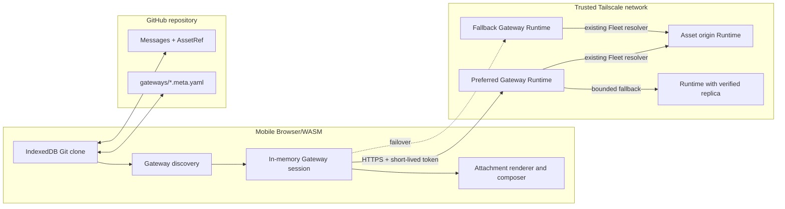
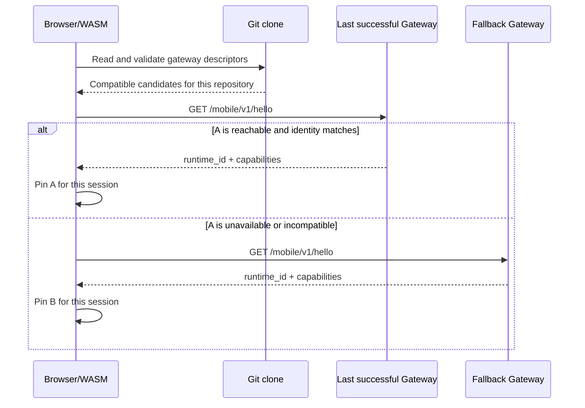
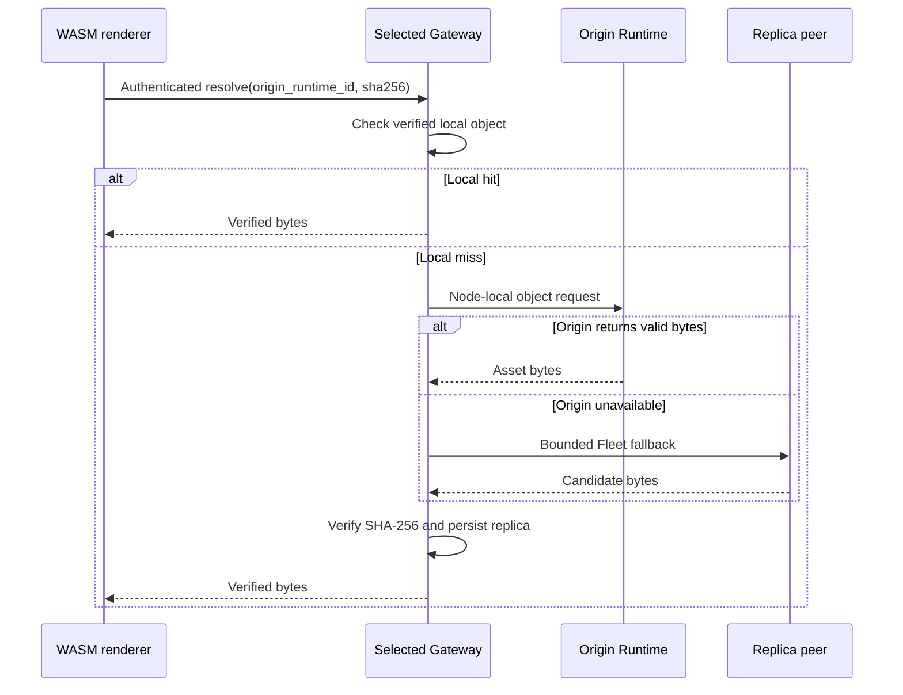
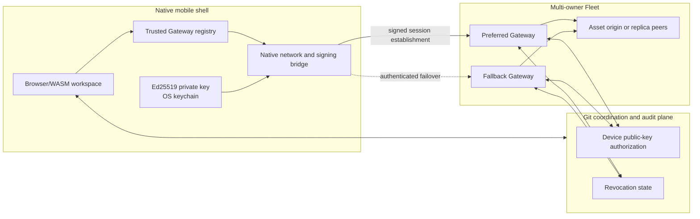
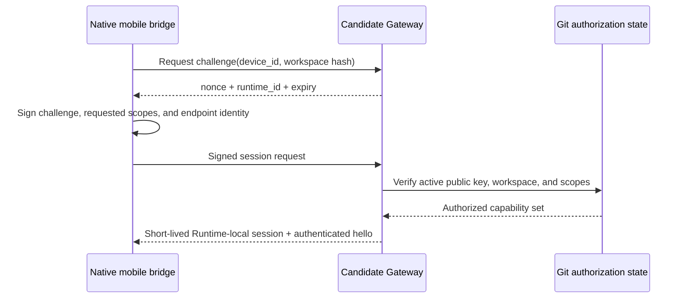

# Mobile Gateway Discovery — Design

Status: APPROVED FOR FUTURE IMPLEMENTATION

## Outcome

A phone running the Browser/WASM frontend can discover a trusted GitIM Runtime
through the Git repository, connect to it over Tailscale, exchange the existing
GitHub repository token for a short-lived Runtime session, and use that Runtime
as the Gateway for attachment upload and resolution.

The design composes the trust boundaries GitIM already uses:

```text
Gateway access = Tailnet reachability + GitHub repository access
```

Git remains the coordination and authorization source. Tailscale supplies private
reachability. Runtime supplies a narrow mobile data-plane endpoint and reuses the
existing content-addressed Fleet Asset Resolver.

## Scope assumptions

- Mobile Gateway v1 supports GitHub-backed Browser/WASM workspaces.
- Gateway candidates are operator-owned machines on the same trusted tailnet.
- The GitHub access token is already available to Browser/WASM for clone, fetch,
  push, and identity inference.
- Runtime exposes only an authenticated mobile route allowlist through Tailscale;
  its administration API stays loopback-only.
- Gateway discovery and attachment reads remain demand-driven. Message polling
  does not prefetch attachment bytes.

Local Git workspaces require a separate authorization decision and are outside
this phase.

## Topology



## Gateway descriptor

An enabled Runtime publishes one low-churn descriptor per workspace:

```text
gateways/<runtime_id>.meta.yaml
```

```yaml
schema_version: 1
runtime_id: 3c6a295e-744a-41dc-ba60-5c21bb94e5a2
endpoint: https://macbook.example-tailnet.ts.net
capabilities:
  - assets.read.v1
  - assets.write.v1
priority: 100
published_by: lewisliu
```

The descriptor changes only when the endpoint, capability set, or priority
changes. Online state and attachment inventory are discovered by probing and do
not create Git commits.

Validation rules:

- `runtime_id` is a canonical lowercase UUID.
- `endpoint` is an HTTPS origin with no credentials, path, query, or fragment.
- capabilities come from the versioned GitIM capability registry.
- `priority` is an integer from 0 through 1000; higher values win.
- `published_by` is a valid GitIM handler.
- the daemon is the only writer and commits the descriptor as the current human.

Browser/WASM reads descriptors from its existing Git clone. A stale or offline
entry is harmless because it fails the live handshake and is skipped.

## Discovery and selection



Candidate order is deterministic:

1. last successful Gateway for the Browser workspace;
2. descriptor priority, descending;
3. measured handshake latency;
4. `runtime_id`, ascending, as the stable tie-breaker.

The selected Gateway stays pinned until a transport failure, identity mismatch,
capability loss, workspace loss, or explicit reconnect. This hysteresis prevents
endpoint flapping.

`hello` is unauthenticated and returns only public protocol information:

```json
{
  "runtime_id": "3c6a295e-744a-41dc-ba60-5c21bb94e5a2",
  "protocol_version": 1,
  "capabilities": ["assets.read.v1", "assets.write.v1"]
}
```

The Runtime response must match the descriptor `runtime_id` before the phone
sends a GitHub token.

## GitHub token exchange

The phone establishes a session for the canonical `workspace_identity`:

```http
POST /mobile/v1/session
Content-Type: application/json

{
  "workspace_identity": "github.com/ciferateam/gitim",
  "github_token": "github_pat_..."
}
```

Runtime performs the same GitHub checks already used during workspace creation:

1. parse and normalize the requested GitHub repository identity;
2. find exactly one local workspace with the same `remote_identity`;
3. call GitHub `/user` with the supplied token;
4. call GitHub `/repos/{owner}/{repo}` and read repository permissions;
5. issue an opaque random session bound to Runtime, workspace, GitHub login, and
   `assets.read` / `assets.write` permissions.

The GitHub token is redacted from logs, never persisted by Gateway auth, and
dropped after the exchange. Sessions live only in Runtime memory, expire after
ten minutes, and are refreshed with the current Browser token when needed.

Permission mapping:

| GitHub permission | Gateway permission |
|---|---|
| repository pull/read | `assets.read` |
| repository push/write | `assets.write` |

Every mobile asset request carries:

```http
Authorization: Bearer <gateway-session-token>
```

The session lookup supplies the local workspace slug. Mobile routes do not trust
a caller-provided slug.

## Runtime mobile surface

Runtime continues to bind its full administration router to `127.0.0.1`. A
separate route allowlist is exposed through a Tailscale HTTPS endpoint:

```text
GET  /mobile/v1/hello
POST /mobile/v1/session
GET  /mobile/v1/assets/resolve/{origin_runtime_id}/{sha256}
HEAD /mobile/v1/assets/resolve/{origin_runtime_id}/{sha256}
POST /mobile/v1/assets
```

Tailscale Serve or an equivalent path-restricted proxy terminates HTTPS and
forwards only this prefix to a dedicated loopback Gateway listener. CORS permits
the configured GitIM web/mobile origins and the headers needed for token exchange
and asset transfer.

The mobile handlers reuse the existing asset store and resolver. They add only
session authorization and workspace lookup before calling the current upload or
resolve service path.

## Asset resolution



Browser/WASM fetches the protected response with an Authorization header and
creates a temporary object URL for inline images. Downloads use the same
authenticated fetch before invoking the browser save flow. Object URLs are
revoked when the component, workspace, or retry generation changes.

Resolution remains demand-driven:

- inline-safe images resolve when they enter the visible message window;
- files resolve after an explicit open or download action;
- a successful Fleet resolution persists a Gateway replica under the existing
  File Attachments v1 rules;
- Fleet and Gateway failures preserve the metadata card and Retry action.

## Upload and send

1. The Browser composer passes selected `File` objects to the active Gateway.
2. Gateway requires an `assets.write` session and uses the existing multipart
   streaming upload path.
3. Gateway returns canonical `AssetRef` values with its own `runtime_id` as the
   origin hint.
4. WASM appends the references to the text message and pushes through the normal
   Git path with the same GitHub token.

Upload completion and message publication remain separate durable steps. A
completed upload whose message push fails is a harmless unreferenced object under
the current persistent-store policy.

## Failure semantics

| Failure | Behavior |
|---|---|
| Tailscale path unavailable | Stop automatic probes, keep metadata readable, retry on user action or browser network recovery. |
| Preferred Gateway offline | Select the next compatible descriptor. |
| Descriptor/Runtime identity mismatch | Reject the candidate before token exchange. |
| GitHub token invalid or revoked | Clear the Gateway session and surface the existing reconnect-token flow. |
| Repository read permission absent | Reject session creation. |
| Repository write permission absent | Allow resolve and reject upload. |
| Asset unavailable through one Gateway | Try one alternate eligible Gateway, then render unavailable metadata with Retry. |
| Integrity mismatch | Discard bytes and continue the existing bounded Fleet resolver. |

Ordinary text reads and writes continue through Browser/WASM regardless of
Gateway state.

## Security boundary

- GitHub repository access authorizes the same message and attachment namespace.
- Tailnet reachability limits who can contact the mobile listener.
- The unauthenticated handshake exposes no workspace list or Fleet topology.
- Runtime identity is verified before sending a GitHub token.
- Gateway auth never logs or persists the presented GitHub token.
- Opaque sessions are random, Runtime-local, workspace-scoped, permission-scoped,
  memory-only, and short-lived.
- Mobile handlers derive workspace paths from the authenticated session.
- Peer object routes remain Runtime-to-Runtime and are not exposed by the mobile
  listener.
- Existing SHA-256 verification, MIME inspection, range handling, upload limits,
  quotas, and workspace-store binding remain authoritative.

## Future trust expansion

The GitHub-token exchange is sufficient while every eligible Gateway belongs to
one trusted operator. A multi-owner Fleet has a different trust boundary: a
Gateway may be reachable on the tailnet and authorized to serve one workspace,
without being trusted to receive a repository-wide GitHub token. That deployment
uses a device capability trust plane.

### Device-capability topology



Four identifiers stay distinct:

| Identifier | Purpose |
|---|---|
| `device_id` | Stable identity for one mobile installation. |
| `runtime_id` | Stable identity for one Gateway Runtime. |
| `workspace_identity` | Canonical repository identity used for authorization and routing. |
| local workspace slug | Gateway-local implementation detail learned only after authentication. |

The phone selects and authorizes by `workspace_identity`; it never assumes that
two nodes use the same local slug.

### Authorization record and pairing

The mobile shell creates an Ed25519 key pair and keeps the private key in the OS
keychain. An explicit QR or deep-link pairing flow authorizes the public key for
specific workspace identities and operation scopes. The bootstrap payload
contains only a Runtime identity, HTTPS endpoint, workspace identity hash, and a
single-use short-lived nonce.

The daemon validates and commits a durable public authorization record:

```yaml
version: 1
device_id: 63ee09bd-26b7-4be3-8127-8e48cb21da73
owner: lewisliu
public_key: ed25519:BASE64_PUBLIC_KEY
scopes:
  - assets.read
  - assets.write
workspace_identities:
  - sha256:WORKSPACE_IDENTITY_HASH
created_at: 2026-07-13T12:00:00Z
revoked_at: null
```

Git carries the public authorization and revocation record, so Fleet nodes
converge through the existing audit plane. Git never carries the private key,
attachment bytes, bearer sessions, or pairing nonce. Revocation updates the same
record and prevents new sessions after normal Git convergence.

### Signed session workflow



Candidate selection keeps the same last-successful, priority, capability, and
hysteresis rules as the GitHub-token phase. The signed response proves Runtime
identity and an exact workspace route before the registry pins the Gateway.

When bearer-token theft is in the threat model, each request also carries a
device proof bound to session ID, workspace identity, method, path, body digest,
timestamp, and nonce. A copied session token then cannot authorize another
device, workspace, or request body.

### Native bridge boundary

The device-capability version uses a native bridge because WebView/WASM should
not access the device private key. The bridge also streams large uploads and
downloads through temporary native files or a WebView scheme handler, avoiding a
single JavaScript memory buffer. WASM continues to own Git synchronization,
`AssetRef` parsing, visibility decisions, and message publication.

### Adoption trigger and reusable foundation

Adopt this trust plane when eligible Gateways can have different owners, when a
GitHub token must not cross the selected Gateway boundary, or when per-device
revocation and request binding become product requirements. Until then, the
GitHub-token phase avoids pairing state and a second authorization system.

The endpoint descriptor, capability manifest, workspace binding, Gateway
registry, session middleware, mobile route allowlist, and asset service boundary
remain reusable. The implementation plan keeps session establishment behind a
small authorizer interface so adding device credentials does not change the
mobile asset API or Fleet resolver.

## Acceptance criteria

- A Browser/WASM workspace discovers compatible Gateway descriptors from Git.
- A trusted tailnet Runtime validates the existing GitHub token and returns a
  short-lived session for the matching repository.
- Repository read access resolves attachments; repository write access uploads
  attachments.
- Browser/WASM renders and downloads verified Runtime assets without receiving a
  Fleet peer URL.
- Preferred Gateway failure recovers through one compatible fallback.
- No Gateway availability state or attachment prefetch creates Git commits.
- With no eligible Gateway, the existing metadata-only Browser/WASM experience
  remains intact.
